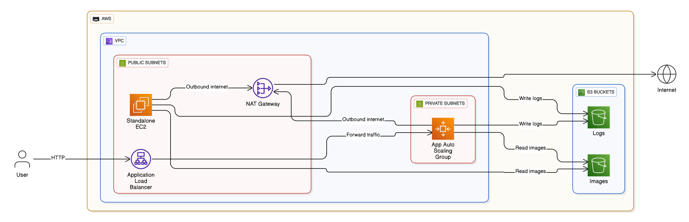

# AWS Technical Challenge Solution

## Solution Overview

This repository contains a proof-of-concept AWS environment deployed using **Terraform**, in accordance with the Coalfire AWS Technical Challenge requirements. The solution includes a modular infrastructure with network segmentation, compute resources, security controls, IAM configuration, and S3 lifecycle management.

### Key Components

- **VPC and Networking**: One VPC (`10.1.0.0/16`) with 4 subnets evenly distributed across two Availability Zones (AZs):
  - Public subnets (Sub1 and Sub2): Internet-accessible
  - Private subnets (Sub3 and Sub4): Isolated from the internet
- **EC2 Instance**: A single `t2.micro` Red Hat Linux instance in Sub2 with 20 GB of root storage and an IAM role with write access to the `logs` S3 bucket.
- **Auto Scaling Group (ASG)**:
  - Runs in Sub3 and Sub4
  - Red Hat Linux AMI
  - Min 1 / Max 6 instances (`t2.micro`, 9 GB)
  - Apache installed via `user_data`
  - IAM role with read-only access to the `images` S3 bucket
- **Application Load Balancer (ALB)**:
  - Listens on HTTP (port 80)
  - Forwards traffic to ASG instances on port 443
- **Security Groups**: Configured to allow only necessary traffic:
  - ALB: HTTP from the internet
  - ASG: Traffic from ALB only
- **IAM Roles**:
  - **EC2**: Write access to `logs` S3 bucket
  - **ASG**: Read access to `images` S3 bucket
- **S3 Buckets**:
  - **images**: Includes `archive/` and `memes/` folders
    - Lifecycle: Move `memes/` objects older than 90 days to Glacier
  - **logs**: Includes `active/` and `inactive/` folders
    - Lifecycle:
      - Move `active/` objects older than 90 days to Glacier
      - Delete `inactive/` objects older than 90 days
- **Terraform Modules**: Custom modules and open-source modules (e.g., for VPC, EC2, ASG, ALB) used where appropriate. Coalfire modules referenced for alignment.

The entire infrastructure is modular, reusable, and follows AWS best practices for security, scalability, and automation.

## Architecture Diagram

The following diagram illustrates the complete AWS infrastructure implemented for this challenge. It follows AWS architectural standards and accurately represents all deployed components and data flows.

> **Legend**:  
> - Public subnets host the Application Load Balancer (ALB), NAT Gateway, and standalone EC2 instance  
> - Private subnets contain the Auto Scaling Group (ASG)  
> - The ALB routes HTTP traffic to the ASG over port 443  
> - The EC2 and ASG instances access S3 buckets (`images` and `logs`) based on their IAM roles  
> - Internet access is provided via the NAT Gateway for private subnets  

This diagram was generated from the actual Terraform configuration using a visual AWS architecture tool, ensuring full alignment with the codebase.

## Testing and Validation

To ensure the integrity and completeness of the Terraform configuration in main.tf, I've implemented automated testing using Terratest, a Go library for testing infrastructure code. This test suite validates that the overall solution plans correctly, including all key resources such as the VPC, EC2 instance, Auto Scaling Group (ASG), Application Load Balancer (ALB), S3 buckets, and IAM roles.

The test script (located in the /test/ directory) runs terraform init and terraform plan, captures the output, and asserts the presence of essential resources. This provides confidence that the infrastructure code is syntactically correct and aligns with the challenge requirements without needing a full deployment (to minimize AWS costs during development).

### Running the Tests
1. Ensure Go is installed and dependencies are fetched (e.g., go mod tidy).
2. Navigate to the /test/ directory.
3. Run go test -v to execute the tests and view verbose output.

Sample output from a successful run confirms 51 resources planned, including IAM roles, with no errors:

--- PASS: TestInfrastructurePlan (11.43s)
PASS
ok  	github.com/fede/coldfire-aws-tech-challenge	11.476s

## Evidence of Successful Deployment

- Terraform Plan Output: (Excerpt) Plan shows 51 resources to add, including aws_vpc, aws_instance, aws_autoscaling_group, aws_lb, aws_s3_bucket, and aws_iam_role. Full log available in test outputs.
- Terraform Apply Logs: (To be added post-apply; e.g., successful creation with resource IDs).
- AWS Console Screenshots: (Embed or link; e.g., VPC dashboard showing subnets, EC2 running, ALB DNS, S3 buckets with lifecycles).
- CLI Verification: Example: aws ec2 describe-instances --filters "Name=tag:Name,Values=coldfire-ec2" (outputs instance details).

## Design Decisions

- Used modular Terraform structure for reusability (e.g., separate files for VPC, IAM policies in /policies/)
- Chose t2.micro for cost efficiency
- Apache installed via user_data for simplicity
- Security groups restrict traffic following least privilege
- S3 lifecycle rules implemented to align with data retention requirements

## Why Testing-Only Approach?

Due to limited access to a live AWS environment during the challenge timeframe, the solution was validated entirely through Terraform planning and automated testing (Terratest) to ensure correct configuration without incurring cloud costs.

## Assumptions

- Default AWS Region: us-east-1
- Latest RHEL 9 AMI used
- Subnet CIDRs adjusted if needed due to OCR errors in the original PDF
- No HTTPS certificate implemented due to challenge scope

## References to Resources Used
- Terraform Documentation: https://www.terraform.io/docs
- AWS Provider: https://registry.terraform.io/providers/hashicorp/aws/latest/docs
- AWS Diagrams: AWS Architecture Icons
- Terratest: https://terratest.gruntwork.io/ (for automated infrastructure testing with Go).

